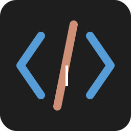

# CodeTyper

<div align="center">
  
  <h3>Create stunning code typing animations in VS Code style</h3>
  
  [](https://opensource.org/licenses/MIT)
  
  
  
  

  <p>
    <a href="#features">Features</a> •
    <a href="#demo">Demo</a> •
    <a href="#installation">Installation</a> •
    <a href="#usage">Usage</a> •
    <a href="#export-options">Export Options</a> •
    <a href="#configuration">Configuration</a> •
    <a href="#technologies">Technologies</a> •
    <a href="#contributing">Contributing</a> •
    <a href="#license">License</a>
  </p>
  
  
</div>

## 🚀 Features

CodeTyper is a powerful web application that lets you create realistic code typing animations with VS Code styling. Perfect for:

- **Tutorials and educational content** - Show code being written step by step
- **Social media posts** - Create eye-catching code animations
- **Presentations** - Add dynamic code demonstrations to your slides
- **Documentation** - Illustrate coding techniques with animations
- **Portfolio pieces** - Showcase your coding skills in a visually appealing way

### Key Features

- 🎨 **Authentic VS Code Appearance** - True-to-life VS Code theme and styling
- 🧠 **Smart Language Detection** - Automatic syntax highlighting for various languages
- 🚶‍♂️ **Developer Personas** - Choose from different typing styles:
  - Junior Developer: Slower with occasional errors
  - Regular Developer: Balanced speed and accuracy
  - Senior Developer: Fast and precise typing
  - 10x Engineer: Lightning-fast coding
- 🎛️ **Customizable Speed** - Adjust typing speed to your preference
- 🎬 **Export to MP4** - Create high-quality videos (up to 4K resolution)
- 🎮 **Interactive Controls** - Start, pause, and reset animations
- 📱 **Responsive Design** - Works on desktop and mobile devices
- 🌐 **Browser-Based** - No installation required

## 🎮 Demo

Check out the [live demo](https://codetyper-delta.vercel.app) to see CodeTyper in action!

Or explore these sample animations:
- [Building a React component](https://example.com/demo1)
- [Solving an algorithm problem](https://example.com/demo2)

## 📥 Installation

### Option 1: Use the hosted version

The easiest way to use CodeTyper is to access the hosted version at [https://codetyper-delta.vercel.app](https://codetyper-delta.vercel.app).

### Option 2: Run locally

To run CodeTyper locally:

1. Clone the repository:
```bash
git clone https://github.com/yourusername/codetyper.git
cd codetyper
```

2. Install dependencies:
```bash
npm install
```

3. Start the development server:
```bash
npm run dev
```

4. Open your browser and navigate to:
```
http://localhost:5173
```

### Option 3: Build for production

To build CodeTyper for production:

```bash
npm run build
```

The built files will be in the `dist` directory, ready to be deployed to any static hosting service.

## 🖥️ Usage

### Basic Animation

1. **Enter Your Code**: Paste or type your code into the editor
2. **Configure Settings**: Choose persona and typing speed
3. **Start Animation**: Click the "Start Animation" button
4. **Reset**: Click "Reset" to start over

### Using Guided Demos

1. Select a demo from the dropdown in the settings panel
2. Read the demo description to understand what you'll see
3. Click "Start Guided Demo" to begin

### Keyboard Shortcuts

- **Ctrl+Enter**: Start animation
- **Esc**: Reset animation
- **Ctrl+E**: Open export dialog
- **Ctrl+,**: Open settings panel

## 🎬 Export Options

CodeTyper offers flexible export options for your animations:

### Video Export (MP4)

Create high-quality MP4 videos with these steps:

1. Click the "Export to MP4" button
2. Paste your code in the dialog
3. Configure export settings:
   - **Resolution**: Choose from 720p, 1080p, 2K, or 4K
   - **Bitrate**: Select quality level (Standard, High, Ultra, or Lossless)
   - **Persona**: Select typing style
   - **Speed**: Adjust animation speed
4. Click "Start Export"
5. Wait for processing to complete
6. Download your MP4 file

#### Resolution Options

| Resolution | Dimensions | Best For |
|------------|------------|----------|
| 720p | 1280×720 | Social media, small file size |
| 1080p | 1920×1080 | General purpose, good quality |
| 2K | 2560×1440 | High quality presentations |
| 4K | 3840×2160 | Professional content, maximum detail |

#### Bitrate Options

| Bitrate | Data Rate | Quality | File Size |
|---------|-----------|---------|-----------|
| Standard | 10 Mbps | Good | Smaller |
| High | 25 Mbps | Very Good | Medium |
| Ultra | 50 Mbps | Excellent | Large |
| Lossless | 150 Mbps | Perfect | Very Large |

## ⚙️ Configuration

### Typing Personas

| Persona | Description |
|---------|-------------|
| Junior Developer | Slower typing with occasional errors and corrections |
| Regular Developer | Balanced typing speed and accuracy |
| Senior Developer | Quick, efficient typing with minimal errors |
| 10x Engineer | Lightning-fast typing with perfect accuracy |

### Speed Configuration

Adjust the typing speed using the slider in the settings panel:
- **0.5x** - Slow and deliberate typing
- **1.0x** - Normal typing speed (default)
- **1.5x** - Fast typing
- **2.0x** - Very fast typing
- **2.5x** - Extremely fast typing

### Custom Styling

CodeTyper uses VS Code's dark theme by default, but you can customize the appearance by modifying the CSS in `src/vscode-theme.css`.

## 💻 Technologies

CodeTyper is built with modern web technologies:

- **Core**:
  - [TypeScript](https://www.typescriptlang.org/) - Type-safe JavaScript
  - [Vite](https://vitejs.dev/) - Next-generation frontend tooling
  
- **Editor**:
  - [CodeMirror 6](https://codemirror.net/6/) - Versatile text editor component
  - Custom syntax highlighting based on language detection
  
- **Video Processing**:
  - [MediaRecorder API](https://developer.mozilla.org/en-US/docs/Web/API/MediaRecorder) - Recording animations
  - Canvas-based rendering for high-quality output
  
- **Styling**:
  - [TailwindCSS](https://tailwindcss.com/) - Utility-first CSS framework
  - Custom VS Code theme styling

## 👥 Contributing

Contributions are welcome! Here's how you can help:

1. **Report bugs** - Open an issue if you find a bug
2. **Suggest features** - Have an idea? Open an issue
3. **Submit PRs** - Fix bugs or add features

Please read [CONTRIBUTING.md](CONTRIBUTING.md) for details on our code of conduct and the process for submitting pull requests.

### Development Setup

1. Fork the repository
2. Clone your fork:
```bash
git clone https://github.com/yourusername/codetyper.git
cd codetyper
```

3. Install dependencies:
```bash
npm install
```

4. Create a branch for your changes:
```bash
git checkout -b feature/your-feature-name
```

5. Make your changes and commit:
```bash
git commit -m "Add your feature description"
```

6. Push to your fork:
```bash
git push origin feature/your-feature-name
```

7. Create a pull request

## 📄 License

This project is licensed under the MIT License - see the [LICENSE](LICENSE) file for details.

## 🙏 Acknowledgements

- Inspired by VS Code and its amazing theme
- Thanks to all contributors who have helped shape this project
- Special thanks to the open source community for providing the tools that make this possible

---

<div align="center">
  <p>Made with ❤️ by SwiftAkira</p>
  <p>
    <a href="https://github.com/yourusername">GitHub</a> •
    <a href="https://twitter.com/yourusername">Twitter</a> •
    <a href="https://codetyper-delta.vercel.app">Try CodeTyper</a>
  </p>
</div> 
